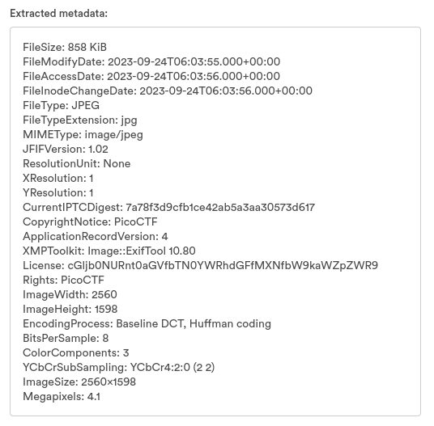
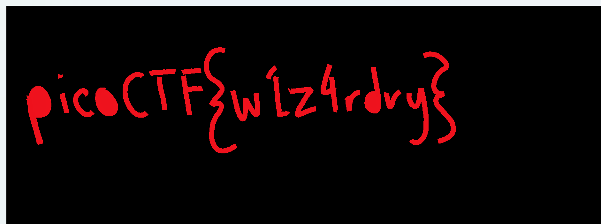
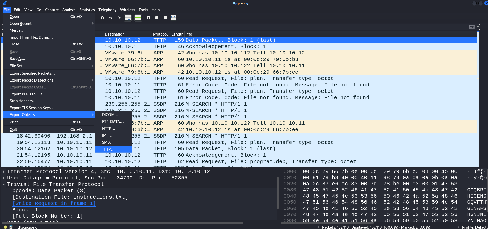
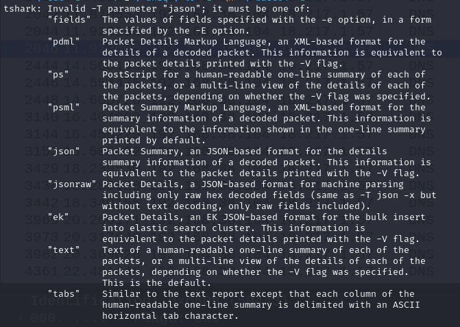
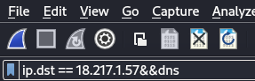
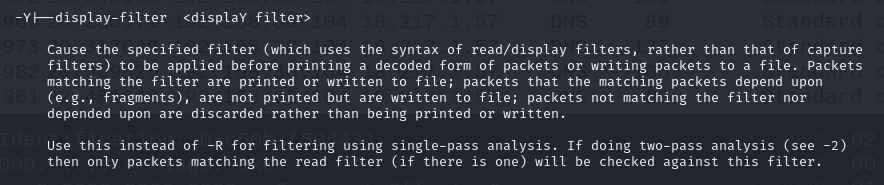
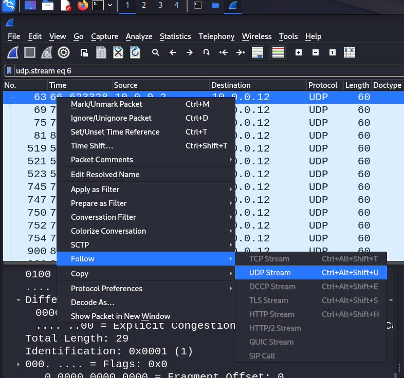
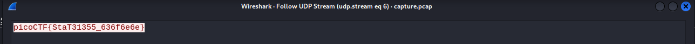
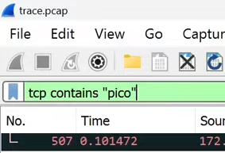

# Forensics

# Disk

---

## **Sleuthkit Intro ( mmls, fls )**

---

<aside>
💡 gunzip filename —> decompress .gz file

</aside>

### mmls

Display the partition layout of a volume system (partition tables)

```bash
gabrielyeh-picoctf@webshell:/tmp$ mmls disk.img 
DOS Partition Table
Offset Sector: 0
Units are in 512-byte sectors

      Slot      Start        End          Length       Description
000:  Meta      0000000000   0000000000   0000000001   Primary Table (#0)
001:  -------   0000000000   0000002047   0000002048   Unallocated
002:  000:000   0000002048   0000204799   0000202752   Linux (0x83)
```

### fls

List file and directory names in a disk image

```bash
gabrielyeh-picoctf@webshell:/tmp$ fls -o 2048 disk.img 
d/d 15617:      home
d/d 11: lost+found
r/r 12: .dockerenv
d/d 21473:      bin
d/d 1953:       boot
d/d 13665:      dev
d/d 17569:      etc
d/d 3905:       lib
d/d 15618:      media
d/d 13669:      mnt
d/d 13670:      opt
d/d 13671:      proc
d/d 15622:      root
d/d 13672:      run
d/d 15623:      sbin
d/d 13673:      srv
d/d 15700:      sys
d/d 13674:      tmp
d/d 15701:      usr
d/d 13675:      var
V/V 25377:      $OrphanFiles
```

<aside>
💡 This looks like the main partition because it has many of the standard linux root directories, like 'home', 'usr', 'root', etc.

</aside>

Using inode to deep into files

```bash
gabrielyeh-picoctf@webshell:/tmp$ fls -o 2048 disk.img 15701
d/d 15702:      bin
d/d 19521:      lib
d/d 19535:      local
d/d 19539:      sbin
d/d 19571:      share
```

## **Disk, disk, sleuth! (srch_strings)**

display printable strings in files

```bash
gabrielyeh-picoctf@webshell:/tmp$ srch_strings dds1-alpine.flag.img | grep pico
ffffffff81399ccf t pirq_pico_get
ffffffff81399cee t pirq_pico_set
ffffffff820adb46 t pico_router_probe
  SAY picoCTF{f0r3ns1c4t0r_n30phyt3_267e38f6}
```

## **Disk, disk, sleuth! II (icat)**

```bash
gabrielyeh-picoctf@webshell:/tmp$ icat -o 2048 dds2-alpine.flag.img 18291
   _     _     _     _     _     _     _     _     _     _     _     _     _  
  / \   / \   / \   / \   / \   / \   / \   / \   / \   / \   / \   / \   / \ 
 ( p ) ( i ) ( c ) ( o ) ( C ) ( T ) ( F ) ( { ) ( f ) ( 0 ) ( r ) ( 3 ) ( n )
  \_/   \_/   \_/   \_/   \_/   \_/   \_/   \_/   \_/   \_/   \_/   \_/   \_/ 
   _     _     _     _     _     _     _     _     _     _     _     _     _  
  / \   / \   / \   / \   / \   / \   / \   / \   / \   / \   / \   / \   / \ 
 ( s ) ( 1 ) ( c ) ( 4 ) ( t ) ( 0 ) ( r ) ( _ ) ( n ) ( 0 ) ( v ) ( 1 ) ( c )
  \_/   \_/   \_/   \_/   \_/   \_/   \_/   \_/   \_/   \_/   \_/   \_/   \_/ 
   _     _     _     _     _     _     _     _     _     _     _  
  / \   / \   / \   / \   / \   / \   / \   / \   / \   / \   / \ 
 ( 3 ) ( _ ) ( 0 ) ( d ) ( 9 ) ( d ) ( 9 ) ( e ) ( c ) ( b ) ( } )
  \_/   \_/   \_/   \_/   \_/   \_/   \_/   \_/   \_/   \_/   \_/
```

## **Operation Orchid (openssl)**

```bash
gabrielyeh-picoctf@webshell:/tmp$ icat disk.flag.img -o 411648 1782 > flag.txt.enc
```

```bash
gabrielyeh-picoctf@webshell:/tmp$ openssl aes256 -salt -out flag.txt -in flag.txt.enc -k unbreakablepassword1234567 -d
```

# Picture

---

## I**nformation (JPEG)**

### strings

print the sequences of printable characters in files

<aside>
💡 strings is mainly useful for determining the contents of non‐text files.

</aside>

### JPEG metadata explorer

[Extract Metadata from an Image | Online Web App | Brandfolder](https://brandfolder.com/workbench/extract-metadata)

### license

We can observe that the license field is not normal.



The term "JPEG license" typically refers to the licensing terms associated with software libraries or tools that encode or decode JPEG images.

Here are a few common licenses associated with software libraries and tools that work with JPEG images:

- GNU General Public License (GPL)
- GNU Lesser General Public License (LGPL)
- MIT License

### exiftool

```bash
exiftool ukn_reality.jpg
```

## **Matryoshka doll ( binwalk )**

tool for searching binary images for embedded files and executable code

```bash
┌──(kali㉿kali)-[~/Desktop]
└─$ binwalk -B dolls.jpg 

DECIMAL       HEXADECIMAL     DESCRIPTION
--------------------------------------------------------------------------------
0             0x0             PNG image, 594 x 1104, 8-bit/color RGBA, non-interlaced
3226          0xC9A           TIFF image data, big-endian, offset of first image directory: 8
272492        0x4286C         Zip archive data, at least v2.0 to extract, compressed size: 378952, uncompressed size: 383937, name: base_images/2_c.jpg
651610        0x9F15A         End of Zip archive, footer length: 22
```

## **tunn3l v1s10n ( bitmap BMP )**

### **Bitmap file header**

A typical application reads this block first to ensure that the file is actually a BMP file and that it is not damaged. 

<aside>
💡 The first 2 bytes of the BMP file format are the character "B" then the character "M" in [ASCII](https://en.wikipedia.org/wiki/ASCII) encoding.

</aside>

[BMP - 維基百科，自由的百科全書](https://zh.wikipedia.org/zh-tw/BMP)

## **Enhance! (SVG, exiftool)**

<aside>
💡 可縮放向量圖形（英語：Scalable Vector Graphics，縮寫：SVG）是一種基於可延伸標記式語言（XML），用於描述二維向量圖形的圖形格式。SVG由W3C制定，是一個開放標準

</aside>

<aside>
💡 exiftool: Read and write meta information in files

</aside>

```bash
┌──(kali㉿kali)-[~/Desktop/tmp]
└─$ man exiftool
```

To solve this problem, just find flag in XML

## **hideme (PNG, ristretto)**

<aside>
💡 可攜式網路圖形（英語：Portable Network Graphics，PNG）是一種支援無失真壓縮的點陣圖圖形格式，支援索引、灰度、RGB三種顏色方案以及Alpha通道等特性。PNG的開發目標是改善並取代GIF作為適合網路傳輸的格式而不需專利許可，所以受廣泛應用於網際網路及其他方面上

</aside>

```bash
┌──(kali㉿kali)-[~/Desktop/tmp]
└─$ ristretto flag.png
```

## **What Lies Within (PNG, eog, zsteg)**

```bash
// eog - a GNOME image viewer
┌──(kali㉿kali)-[~/Desktop/tmp]
└─$ eog buildings.png
```

```bash
// zsteg : 找出藏在png中的隱藏訊息
┌──(kali㉿kali)-[~/Desktop/tmp]
└─$ zsteg buildings.png 
b1,r,lsb,xy         .. text: "^5>R5YZrG"
b1,rgb,lsb,xy       .. text: "picoCTF{h1d1ng_1n_th3_b1t5}"
b1,abgr,msb,xy      .. file: PGP Secret Sub-key -
b2,b,lsb,xy         .. text: "XuH}p#8Iy="
b3,abgr,msb,xy      .. text: "t@Wp-_tH_v\r"
b4,r,lsb,xy         .. text: "fdD\"\"\"\" "
b4,r,msb,xy         .. text: "%Q#gpSv0c05"
b4,g,lsb,xy         .. text: "fDfffDD\"\""
b4,g,msb,xy         .. text: "f\"fff\"\"DD"
b4,b,lsb,xy         .. text: "\"$BDDDDf"
b4,b,msb,xy         .. text: "wwBDDDfUU53w"
b4,rgb,msb,xy       .. text: "dUcv%F#A`"
b4,bgr,msb,xy       .. text: " V\"c7Ga4"
b4,abgr,msb,xy      .. text: "gOC_$_@o"
```

## **advanced-potion-making (PNG, IHDR, file signature)**

<aside>
💡 A valid PNG image must contain an IHDR chunk, one or more IDAT chunks, and an IEND chunk.

</aside>

[File Signatures](https://www.garykessler.net/library/file_sigs.html)

After the recovery, throw the png file into paint and fill in the background( can try this method when encountering single-color image)



## Steghide

# **MacroHard WeakEdge ( oletools )**

---

## What is OLE

Object Linking & Embedding (OLE) is a proprietary technology developed by Microsoft that allows embedding and linking to documents and other objects

<aside>
💡 駭客如果在郵件中嵌入危險OLE物件，就可以對其肆意偽裝，有可能騙過使用者導致安全問題。

</aside>

## Oletools

oletools is a package of python tools to analyze Microsoft OLE2 files (also called Structured Storage, Compound File Binary Format or Compound Document File Format), such as Microsoft Office documents or Outlook messages, mainly for malware analysis, forensics and debugging. It is based on the olefile parser.

[Kali Linux / Packages / python-oletools · GitLab](https://gitlab.com/kalilinux/packages/python-oletools)

## olevba

olevba is a script to parse OLE and OpenXML files such as MS Office documents (e.g. Word, Excel), to extract VBA Macro code in clear text, deobfuscate and analyze malicious macros.

<aside>
💡 VBA: **V**isual **B**asic for **A**pplications（**VBA**）是[Visual Basic](https://zh.wikipedia.org/wiki/Visual_Basic)的一種[巨集](https://zh.wikipedia.org/wiki/%E5%AE%8F)語言，主要能用來擴展Windows的應用程式功能，特別是[Microsoft Office](https://zh.wikipedia.org/wiki/Microsoft_Office)軟體

</aside>

```bash
┌──(kali㉿kali)-[~/Desktop/tmp]
└─$ olevba Forensics\ is\ fun.pptm 
olevba 0.60.1 on Python 2.7.18 - http://decalage.info/python/oletools
===============================================================================
FILE: Forensics is fun.pptm
Type: OpenXML
WARNING  For now, VBA stomping cannot be detected for files in memory
-------------------------------------------------------------------------------
VBA MACRO Module1.bas 
in file: ppt/vbaProject.bin - OLE stream: u'VBA/Module1'
- - - - - - - - - - - - - - - - - - - - - - - - - - - - - - - - - - - - - - - 
Sub not_flag()
    Dim not_flag As String
    not_flag = "sorry_but_this_isn't_it"
End Sub
No suspicious keyword or IOC found.

/usr/local/lib/python2.7/dist-packages/msoffcrypto/method/ecma376_agile.py:8: CryptographyDeprecationWarning: Python 2 is no longer supported by the Python core team. Support for it is now deprecated in cryptography, and will be removed in the next release.
  from cryptography.hazmat.backends import default_backend
```

# Wireshark

---

## **Trivial Flag Transfer Protocol**

### wireshark ( file → export objects )



## **Wireshark twoo twooo two twoo... (tshark, MIME, Kerberos)**

<aside>
💡 "MIME multipart" is a technique used in the context of email and web communication to package and transmit multiple pieces of content within a single message or document. MIME stands for "Multipurpose Internet Mail Extensions," and it is a standard that extends the format of email messages and web content to support text in character sets other than ASCII, as well as attachments of audio, video, images, and application programs.

</aside>

<aside>
💡 Kerberos是一種電腦網路授權協定，用來在非安全網路中，對個人通信以安全的手段進行身分認證

</aside>

tshark is a terminal version of wireshark

```bash
 ┌──(kali㉿kali)-[~/Desktop/tmp]
└─$ tshark -r /home/kali/Desktop/tmp/shark2.pcapng -e "dns.qry.name" -Y "ip.dst == 18.217.1.57&&dns" -Tfields | tr "." " " | cut -d " " -f 1 | uniq | tr -d "\n" | base64 -d
picoCTF{dns_3xf1l_ftw_deadbeef}
```

-T, -e: (in the upper case, it means ”the item have ‘dns.qry.name’ field which is not empty)



extract in wireshark:



-Y (filter):



## **shark on wire 1**

<aside>
💡 follow the stream —> print the conversation

</aside>





also I use:

```bash
┌──(kali㉿kali)-[~/Desktop/tmp]
└─$ tshark -r capture.pcap -Y "(((eth.addr==00:0c:29:b9:02:a9 && eth.addr==ff:ff:ff:ff:ff:ff) ) && (udp.dstport == 8888)) && (ip.dst == 10.0.0.12)" -Tfields -e "data" | tr -d "\n" | xxd -r -p
picoCTF{StaT31355_636f6e6e}
```

## **PcapPoisoning ( wireshark filter )**



# files

---

## PDF

### **Redaction gone wrong (atril, pdftotext)**

```bash
// can used to open pdf file
┌──(kali㉿kali)-[~/Desktop/tmp]
└─$ atril Financial_Report_for_ABC_Labs.pdf
```

```bash
// convert pdf to pure text
┌──(kali㉿kali)-[~/Desktop/tmp]
└─$ pdftotext Financial_Report_for_ABC_Labs.pdf
```

## Shar ( shell archive )

### **File types**

# Others

---

## hexeditor

```bash
┌──(kali㉿kali)-[~/Desktop/tmp]
└─$ hexeditor advanced-potion-making
```